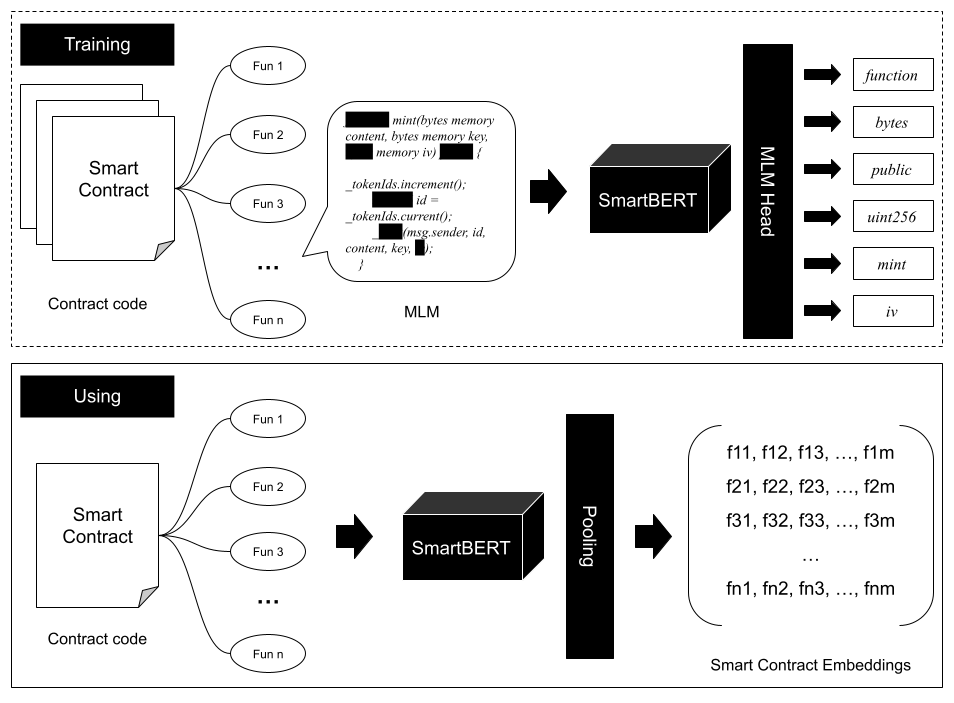

# SmartBERT

🧐 Learn representations from **smart contracts**!



## Introduction

**SmartBERT** is a pre-trained programming language model specifically fine-tuned for analyzing **Smart Contracts**. Based on [microsoft/codebert-base-mlm](https://huggingface.co/microsoft/codebert-base-mlm), which itself follows the [RoBERTa](https://huggingface.co/facebook/roberta-base) architecture using a simple **Masked Language Model (MLM)** objective, SmartBERT converts _function-level_ code into embeddings utilized in various downstream tasks in smart contract analysis.

## Installation

To set up the environment for SmartBERT, it is recommended to first create a virtual python (3.9) environment using tools like [Anaconda](https://www.anaconda.com/).

```bash
conda create -n smartbert python=3.9
```

Then, install the required packages with:

```bash
pip install -r requirement.txt
```

Download the **SmartBERT** models from <https://github.com/web3se-lab/SmartBERT/releases> and unzip all files into the `/model` directory, e.g., `/model/SmartBERT-v2/`.

Or, you can download **SmartBERT** from 🤗 Hugging Face: <https://huggingface.co/web3se/SmartBERT-v2>.

```bash
git lfs install

git clone https://huggingface.co/web3se/SmartBERT-v2
```

## Usage

### Running the API

Start the API server using the command:

```bash
./api.sh
```

## API Documentation

Please always input smart contract **_function-level_** code into **SmartBERT**.

### Tokenize

**Endpoint:** `http://localhost:9900/tokenize`

Use the **POST** method with **JSON** to tokenize text.

**Request:**

```json
{
  "text": "Smart Contract function-level code here..."
}
```

**Response:**

```json
[
  {
    "token": ["<s>", "//", "SP", "DX", "-", "License"],
    "ids": [0, 42326, 4186, 40190, 12],
    "masks": [1, 1, 1, 1, 0]
  }
]
```

### Embedding

Available pooling methods: average pooling, max pooling, CLS token pooling, and `pooler_output`.

**Endpoint:** `http://localhost:9900/embedding`

**Request:**

```json
{
  "text": ["function totalSupply() external view returns (uint256);"],
  "pool": "avg"
}
```

- `text`: A string or an array of strings containing smart contract function code snippets.
- `pool`: Can be one of `avg`, `max`, `cls`, `out`.

**Response:**

```json
{
  "embedding": [
    [-0.006051725707948208, 0.10594873130321503, 0.07721099257469177, ...]
  ],
  "object": "embedding.avg"
}
```

- `embedding`: Contains 768-dimensional vectors representing the input texts.

## Retraining

To retrain SmartBERT, first download the original RoBERTa-based model:

```bash
cd base-model
git lfs install
git clone https://huggingface.co/microsoft/codebert-base-mlm
```

Update the `OLD_MODEL` variable in `train.py` to point to your original model directory.

Place the dataset files `train.jsonl` (for training) and `eval.jsonl` (for evaluation) in the `/data` directory.

Then, initiate the training process by running:

```bash
./train.sh
```

Further customization of training settings can be done in `train.py`.

## Setup

### SmartBERT Versions

- **[V1](https://huggingface.co/web3se/SmartBERT)**: Trained on a dataset of over **40,000** smart contracts using the [RoBERTa-base](https://huggingface.co/FacebookAI/roberta-base) model.
- **[V2](https://huggingface.co/web3se/SmartBERT-v2)**: Transitioned to the [CodeBERT-base-MLM](https://huggingface.co/microsoft/codebert-base-mlm) model, trained on **16,000** smart contracts.
- **[V3](https://huggingface.co/web3se/SmartBERT-v3)**: Trained on the V2 foundation with an expanded dataset of **80,000** smart contracts, enabling comprehensive training on our complete dataset.

**_Why Only 16,000 Smart Contracts for V2?_**

The **V2** dataset is specifically utilized in the **SmartIntentNN** project, available at <https://github.com/web3se-lab/web3-sekit>. It is important to note that the pre-trained model should not cover the evaluation dataset used for downstream model tasks. This is to ensure that the evaluation results remain unbiased and accurately reflect the model's performance on unseen data. Therefore, the choice to limit the training dataset to **16,000** smart contracts was made to avoid any overlap with the downstream evaluation data.

## References

- [RoBERTa](https://huggingface.co/facebook/roberta-base)
- [CodeBERT-base-mlm](https://huggingface.co/microsoft/codebert-base-mlm)

## Citations

```tex
@article{huang2025smart,
  title={Smart Contract Intent Detection with Pre-trained Programming Language Model},
  author={Huang, Youwei and Li, Jianwen and Fang, Sen and Li, Yao and Yang, Peng and Hu, Bin},
  journal={arXiv preprint arXiv:2508.20086},
  year={2025}
}
```

## Contributors

Developed by **[Youwei Huang](https://www.devil.ren)**

Trained by **[Sen Fang](https://github.com/TomasAndersonFang)** and **[Youwei Huang](https://www.devil.ren)**

## Acknowledgments

- [Institute of Intelligent Computing Technology, Suzhou, CAS](http://iict.ac.cn)
